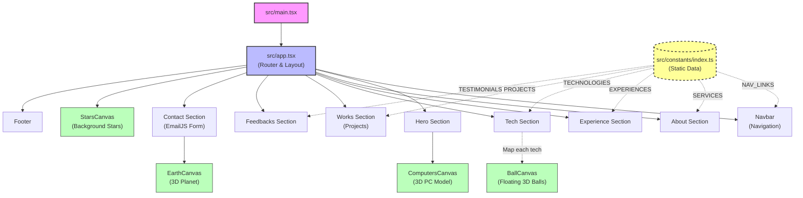

# Deep Dive: 3D Portfolio Architecture

This document provides a comprehensive technical explanation of the 3D Portfolio application. It goes beyond the standard usage instructions to explain *how* the application works, its architectural patterns, and the data flow.

## 1. High-Level Architecture

The application is a **Single Page Application (SPA)** built with **React** and **Vite**. It leverages **Three.js** (via `@react-three/fiber`) for 3D graphics and **Framer Motion** for complex 2D animations.

### Core Principles
-   **Data-Driven UI**: Content (Experience, Projects, Testimonials) is decoupled from the UI components. It lives in `src/constants/index.ts`, making the site easy to update without touching React code.
-   **Component-Based 3D**: 3D scenes are broken down into declarative React components (`<ComputersCanvas />`, `<EarthCanvas />`), mixing standard DOM elements with WebGL canvases.
-   **Higher-Order Components (HOC)**: A `SectionWrapper` HOC is used to wrap main sections, applying consistent padding and "enter-viewport" animations automatically.

## 2. System Diagram

The following diagram illustrates the component hierarchy and data flow within the application.



## 3. Directory Structure Breakdown

The `src` directory is organized by function rather than type:

*   **`src/components/`**: Contains all visual elements.
    *   **`canvas/`**: Specialized folder for **Three.js** scenes. This isolates the complex 3D logic (lights, meshes, loaders) from the standard React UI.
*   **`src/hoc/`**: Contains Higher-Order Components.
    *   **`SectionWrapper.tsx`**: Wraps components with `framer-motion` logic. Instead of adding `initial={{opacity: 0}} whileInView={{opacity: 1}}` to every section, this wrapper handles it globally.
*   **`src/constants/`**: The "Database" of the frontend.
    *   **`index.ts`**: If you want to change the text on the website, add a new project, or change a skill icon, you edit *this file only*.
*   **`src/utils/`**: Helper functions.
    *   **`motion.ts`**: Stores complex animation variants (e.g., `fadeIn`, `slideIn`, `staggerContainer`) to keep component files clean.

## 4. Key Technologies Explained

### 3D Rendering (@react-three/fiber)
Standard Three.js is imperative (e.g., `scene.add(cube)`). This project uses `@react-three/fiber` to make it declarative:
```jsx
<Canvas>
  <ambientLight intensity={0.5} />
  <mesh>
    <boxGeometry />
    <meshStandardMaterial color="orange" />
  </mesh>
</Canvas>
```
This allows the 3D elements (`ComputersCanvas`, `EarthCanvas`) to react to state changes and props just like normal `<div>`s.

### Animations (Framer Motion)
The site uses **Framer Motion** for all 2D transitions.
-   **Scroll-triggered animations**: Sections fade in or slide up as you scroll down.
-   **Variants**: Reusable animation definitions defined in `src/utils/motion.ts`.

### Email Integration (EmailJS)
The contact form in `src/components/contact.tsx` connects directly to **EmailJS**.
-   It captures user input (`name`, `email`, `message`).
-   Sends it to the configured EmailJS service (environemnt variables in `.env`).
-   No backend server is required for this feature.

## 5. Typical Workflows

### How to Add a New Project
1.  Add the project image to `src/assets/`.
2.  Import the image in `src/constants/index.ts`.
3.  Add a new object to the `PROJECTS` array in `src/constants/index.ts`.
    *   The `Works` component will automatically map over this array and render a new card.

### How to Change 3D Models
The 3D models are GLTF/GLB files loaded in the components under `src/components/canvas/`.
1.  Place new `.glb` file in `public/`.
2.  Edit `src/components/canvas/Computers.tsx` (for example).
3.  Update the `useGLTF('./path/to/model.glb')` hook.
4.  Adjust `scale`, `position`, and `rotation` props of the `<primitive />` object to fit the scene.
